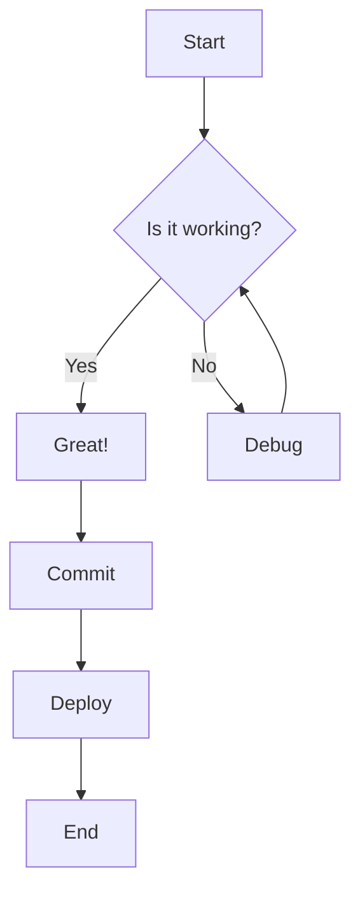
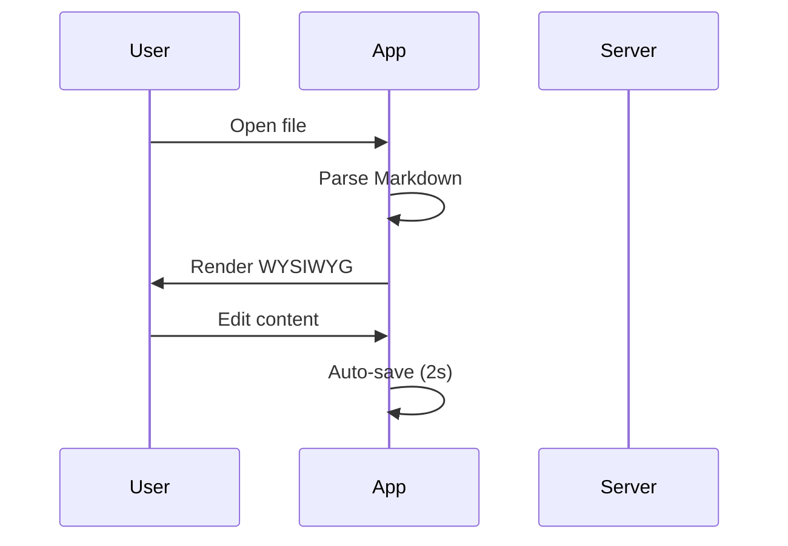
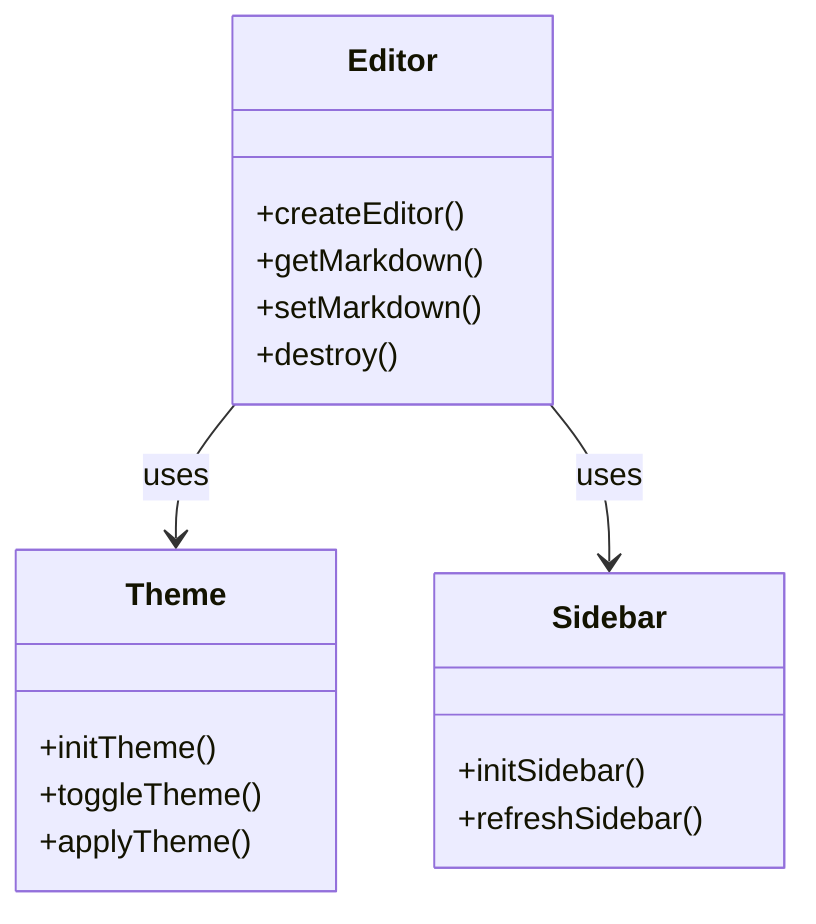
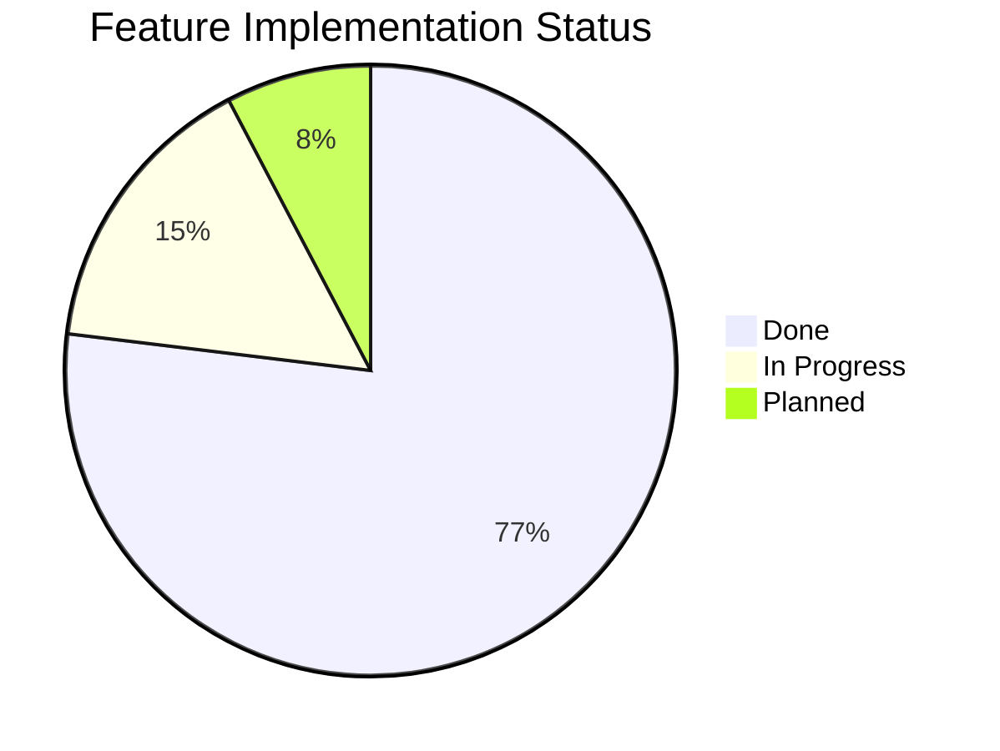

# Markdown WYSIWYG Editor — Implementation Plan

> **For agentic workers:** REQUIRED SUB-SKILL: Use superpowers:subagent-driven-development (recommended) or superpowers:executing-plans to implement this plan task-by-task. Steps use checkbox (`- [ ]`) syntax for tracking.

**Goal:** Build a Windows desktop WYSIWYG Markdown editor using Electron + Milkdown Crepe, with LaTeX math, Mermaid diagrams, code highlighting, file-tree sidebar, PDF export, auto-save, and light/dark theme.

**Architecture:** Electron shell with a vanilla-JS renderer bundled by Vite. Milkdown Crepe provides the WYSIWYG editor (all Markdown rendering + inline editing). Main process handles file I/O, PDF export, and system theme detection via IPC. Renderer DOM post-processes Mermaid code blocks into rendered diagrams.

**Tech Stack:** Electron 33+, @milkdown/crepe 7.15+ (bundles Milkdown core, CommonMark, GFM, KaTeX, CodeMirror), Mermaid 11+, Vite 6+, electron-builder 25+ with NSIS target.

## Global Constraints

- No React/Vue frameworks — vanilla JS only in renderer
- No split-source/preview mode — pure WYSIWYG
- No tabs — single file at a time
- No network features — fully offline local app
- Cold start < 3 seconds, default window 1200×800
- Installer auto-registers .md file association (requires `nsis.perMachine: true`)
- Default theme follows Windows system theme (detected via Electron `nativeTheme`)
- Milkdown Crepe replaces the individually-named @milkdown/core + preset-commonmark + theme-nord (Crepe bundles all three with WYSIWYG on top)
- MathJax requirement satisfied by KaTeX (Milkdown math plugin uses KaTeX — identical LaTeX rendering, faster)
- Code highlighting uses Crepe's built-in CodeMirror (equivalent to Prism/Shiki in output)
- All renderer dependencies bundled via Vite; main/preload are CommonJS run directly by Electron

---

## File Structure (post-implementation)

```
md-editor/
├── package.json              # Dependencies + electron-builder config
├── vite.config.js            # Vite config (bundles src/ → dist-renderer/)
├── .gitignore
├── electron/
│   ├── main.js               # Electron main process (CJS)
│   └── preload.js            # contextBridge IPC (CJS)
├── src/
│   ├── index.html            # Entry HTML (sidebar + editor + status-bar layout)
│   ├── style.css             # All styles: layout, light/dark theme vars, Milkdown overrides
│   ├── app.js                # Bootstrap: wires editor, theme, sidebar, auto-save, mermaid
│   ├── editor.js             # Milkdown Crepe factory (create/destroy/getMarkdown/setMarkdown)
│   ├── theme.js              # System theme detection + toggle + persistence
│   ├── sidebar.js            # File-tree sidebar (list .md files, click to switch)
│   ├── mermaid.js            # DOM post-processing: find ```mermaid blocks → render SVG
│   └── export.js             # Trigger PDF export via IPC
├── assets/
│   └── icon.svg              # SVG icon (convert to PNG before packaging)
├── scripts/
│   └── generate-icon.js      # Node script to generate a simple Markdown-style icon
├── dist/                     # electron-builder output (NSIS .exe installer)
└── dist-renderer/            # Vite build output (not committed)
```

---

### Task 1: Project Scaffolding

**Files:**
- Create: `package.json`
- Create: `vite.config.js`
- Create: `.gitignore`
- Create: `electron/` directory
- Create: `src/` directory
- Create: `assets/` directory
- Create: `scripts/` directory

**Interfaces:**
- Produces: `package.json` with all deps, `vite.config.js` with Electron-aware config, npm installed

- [ ] **Step 1: Create directory structure**

```bash
cd "C:/Users/10339/OneDrive/桌面/origin_data/Markdown阅读器"
mkdir -p electron src assets scripts dist
```

- [ ] **Step 2: Write package.json**

```json
{
  "name": "md-editor",
  "version": "1.0.0",
  "description": "WYSIWYG Markdown Editor for Windows",
  "main": "electron/main.js",
  "scripts": {
    "dev": "vite build --watch & sleep 2 && electron .",
    "build:renderer": "vite build",
    "start": "electron .",
    "pack": "npm run build:renderer && electron-builder --win",
    "icon": "node scripts/generate-icon.js"
  },
  "dependencies": {
    "@milkdown/crepe": "^7.15.5",
    "mermaid": "^11.4.0"
  },
  "devDependencies": {
    "electron": "^33.2.0",
    "electron-builder": "^25.1.0",
    "vite": "^6.0.0"
  },
  "build": {
    "appId": "com.markdown-editor.app",
    "productName": "Markdown Editor",
    "directories": {
      "output": "dist"
    },
    "files": [
      "electron/**/*",
      "dist-renderer/**/*",
      "assets/**/*"
    ],
    "fileAssociations": [
      {
        "ext": ["md", "markdown", "mdown", "mdtext"],
        "name": "Markdown",
        "description": "Markdown document"
      }
    ],
    "nsis": {
      "oneClick": false,
      "perMachine": true,
      "allowToChangeInstallationDirectory": true
    },
    "win": {
      "target": "nsis",
      "icon": "assets/icon.png"
    }
  }
}
```

- [ ] **Step 3: Write vite.config.js**

```js
// vite.config.js
import { defineConfig } from 'vite';

export default defineConfig({
  base: './',
  root: 'src',
  build: {
    outDir: '../dist-renderer',
    emptyOutDir: true,
  },
});
```

- [ ] **Step 4: Write .gitignore**

```
node_modules/
dist/
dist-renderer/
*.exe
*.log
```

- [ ] **Step 5: Install dependencies**

```bash
npm install
```

Verify: `node_modules/@milkdown/crepe`, `node_modules/mermaid`, `node_modules/electron`, `node_modules/electron-builder`, `node_modules/vite` all exist.

- [ ] **Step 6: Verify Vite build works (smoke test)**

Create `src/index.html`:

```html
<!DOCTYPE html>
<html lang="en">
<head><meta charset="UTF-8"><title>Test</title></head>
<body><h1>Vite OK</h1><script type="module" src="app.js"></script></body>
</html>
```

Create `src/app.js`:

```js
console.log('Vite build works!');
```

```bash
npx vite build
```

Expected: `dist-renderer/index.html` created. Then clean up test files.

- [ ] **Step 7: Commit**

```bash
git init
git add package.json vite.config.js .gitignore
git commit -m "chore: scaffold project with Electron + Milkdown + Mermaid + Vite"
```

---

### Task 2: Electron Main Process

**Files:**
- Create: `electron/main.js`

**Interfaces:**
- Produces: BrowserWindow 1200×800, application menu, IPC handlers
- IPC channels (handle): `file:read`, `file:write`, `file:open-dialog`, `dir:list`, `export:pdf`, `theme:get-system`
- IPC channels (send to renderer): `menu:action`, `file:opened`

- [ ] **Step 1: Write electron/main.js**

```js
// electron/main.js
const { app, BrowserWindow, Menu, ipcMain, dialog, nativeTheme } = require('electron');
const path = require('path');
const fs = require('fs');

let mainWindow = null;
let currentFilePath = null;

// ── Window ──
function createWindow() {
  mainWindow = new BrowserWindow({
    width: 1200,
    height: 800,
    minWidth: 800,
    minHeight: 600,
    backgroundColor: nativeTheme.shouldUseDarkColors ? '#1e1e1e' : '#ffffff',
    webPreferences: {
      preload: path.join(__dirname, 'preload.js'),
      contextIsolation: true,
      nodeIntegration: false,
      sandbox: false,
    },
    title: 'Markdown Editor',
    show: false,
  });

  const isDev = process.argv.includes('--dev');
  if (isDev) {
    mainWindow.loadURL('http://localhost:5173');
    mainWindow.webContents.openDevTools();
  } else {
    mainWindow.loadFile(path.join(__dirname, '..', 'dist-renderer', 'index.html'));
  }

  mainWindow.once('ready-to-show', () => mainWindow.show());
  mainWindow.on('closed', () => { mainWindow = null; });
}

// ── Menu ──
function buildMenu() {
  const template = [
    {
      label: 'File',
      submenu: [
        { label: 'Open...', accelerator: 'Ctrl+O', click: handleOpenFile },
        { label: 'Save', accelerator: 'Ctrl+S', click: () => mainWindow?.webContents.send('menu:action', 'save') },
        { type: 'separator' },
        { label: 'Export PDF...', accelerator: 'Ctrl+Shift+P',
          click: () => mainWindow?.webContents.send('menu:action', 'export-pdf') },
        { type: 'separator' },
        { label: 'Exit', accelerator: 'Alt+F4', click: () => app.quit() },
      ],
    },
    {
      label: 'Edit',
      submenu: [
        { label: 'Undo', accelerator: 'Ctrl+Z', role: 'undo' },
        { label: 'Redo', accelerator: 'Ctrl+Y', role: 'redo' },
        { type: 'separator' },
        { label: 'Cut', accelerator: 'Ctrl+X', role: 'cut' },
        { label: 'Copy', accelerator: 'Ctrl+C', role: 'copy' },
        { label: 'Paste', accelerator: 'Ctrl+V', role: 'paste' },
        { label: 'Select All', accelerator: 'Ctrl+A', role: 'selectAll' },
      ],
    },
    {
      label: 'View',
      submenu: [
        { label: 'Toggle Theme', accelerator: 'Ctrl+T',
          click: () => mainWindow?.webContents.send('menu:action', 'toggle-theme') },
        { type: 'separator' },
        { label: 'Toggle Developer Tools', accelerator: 'F12', role: 'toggleDevTools' },
      ],
    },
  ];
  Menu.setApplicationMenu(Menu.buildFromTemplate(template));
}

// ── File Operations ──
async function handleOpenFile() {
  const result = await dialog.showOpenDialog(mainWindow, {
    title: 'Open Markdown File',
    filters: [{ name: 'Markdown', extensions: ['md', 'markdown', 'mdown', 'mdtext'] }],
    properties: ['openFile'],
  });
  if (!result.canceled && result.filePaths.length > 0) {
    loadFile(result.filePaths[0]);
  }
}

function loadFile(filePath) {
  try {
    const content = fs.readFileSync(filePath, 'utf-8');
    currentFilePath = filePath;
    mainWindow?.setTitle(`${path.basename(filePath)} — Markdown Editor`);
    mainWindow?.webContents.send('file:opened', { path: filePath, content });
  } catch (err) {
    dialog.showErrorBox('Error', `Cannot open file: ${err.message}`);
  }
}

// ── IPC Handlers ──
function setupIPC() {
  ipcMain.handle('file:read', async (_e, fp) => {
    try { return { success: true, content: fs.readFileSync(fp, 'utf-8') }; }
    catch (err) { return { success: false, error: err.message }; }
  });

  ipcMain.handle('file:write', async (_e, fp, content) => {
    try { fs.writeFileSync(fp, content, 'utf-8'); currentFilePath = fp; return { success: true }; }
    catch (err) { return { success: false, error: err.message }; }
  });

  ipcMain.handle('file:open-dialog', async () => {
    const result = await dialog.showOpenDialog(mainWindow, {
      title: 'Open Markdown File',
      filters: [{ name: 'Markdown', extensions: ['md', 'markdown', 'mdown', 'mdtext'] }],
      properties: ['openFile'],
    });
    if (result.canceled || !result.filePaths.length) return { success: false };
    const fp = result.filePaths[0];
    const content = fs.readFileSync(fp, 'utf-8');
    currentFilePath = fp;
    mainWindow?.setTitle(`${path.basename(fp)} — Markdown Editor`);
    return { success: true, path: fp, content };
  });

  ipcMain.handle('dir:list', async (_e, dirPath) => {
    try {
      const entries = fs.readdirSync(dirPath, { withFileTypes: true });
      const files = entries
        .filter(e => e.isFile() && e.name.match(/\.(md|markdown|mdown|mdtext)$/i))
        .map(e => ({ name: e.name, path: path.join(dirPath, e.name) }));
      return { success: true, files, dirPath };
    } catch (err) { return { success: false, error: err.message }; }
  });

  ipcMain.handle('export:pdf', async () => {
    if (!mainWindow) return { success: false, error: 'No window' };
    const result = await dialog.showSaveDialog(mainWindow, {
      title: 'Export PDF',
      defaultPath: currentFilePath ? currentFilePath.replace(/\.(md|markdown)$/i, '.pdf') : 'document.pdf',
      filters: [{ name: 'PDF', extensions: ['pdf'] }],
    });
    if (result.canceled) return { success: false, error: 'canceled' };
    try {
      const pdfData = await mainWindow.webContents.printToPDF({
        printBackground: true,
        preferCSSPageSize: true,
        margins: { top: 20, bottom: 20, left: 20, right: 20 },
      });
      fs.writeFileSync(result.filePath, pdfData);
      return { success: true, path: result.filePath };
    } catch (err) { return { success: false, error: err.message }; }
  });

  ipcMain.handle('theme:get-system', () => nativeTheme.shouldUseDarkColors ? 'dark' : 'light');
  ipcMain.handle('dialog:show-error', async (_e, title, msg) => { dialog.showErrorBox(title, msg); });
}

// ── Lifecycle ──
app.whenReady().then(() => {
  setupIPC();
  buildMenu();
  createWindow();

  app.on('open-file', (_e, fp) => {
    if (app.isReady()) loadFile(fp);
    else app.once('ready', () => loadFile(fp));
  });

  // Open file from command-line arg (double-click in Explorer)
  const fileArg = process.argv.slice(1).find(a => a.match(/\.(md|markdown)$/i));
  if (fileArg) loadFile(fileArg);
});

app.on('window-all-closed', () => app.quit());
app.on('activate', () => { if (!BrowserWindow.getAllWindows().length) createWindow(); });
```

- [ ] **Step 2: Commit**

```bash
git add electron/main.js
git commit -m "feat: Electron main process with menu, IPC, file ops, PDF export"
```

---

### Task 3: Preload Script

**Files:**
- Create: `electron/preload.js`

**Interfaces:**
- Produces: `window.electronAPI` with methods matching main process IPC channels

- [ ] **Step 1: Write electron/preload.js**

```js
// electron/preload.js
const { contextBridge, ipcRenderer } = require('electron');

contextBridge.exposeInMainWorld('electronAPI', {
  readFile: (fp) => ipcRenderer.invoke('file:read', fp),
  writeFile: (fp, content) => ipcRenderer.invoke('file:write', fp, content),
  openFileDialog: () => ipcRenderer.invoke('file:open-dialog'),
  listDir: (dirPath) => ipcRenderer.invoke('dir:list', dirPath),
  exportPDF: () => ipcRenderer.invoke('export:pdf'),
  getSystemTheme: () => ipcRenderer.invoke('theme:get-system'),
  onMenuAction: (cb) => { ipcRenderer.on('menu:action', (_e, action) => cb(action)); },
  onFileOpened: (cb) => { ipcRenderer.on('file:opened', (_e, data) => cb(data)); },
  showError: (title, msg) => ipcRenderer.invoke('dialog:show-error', title, msg),
});
```

- [ ] **Step 2: Commit**

```bash
git add electron/preload.js
git commit -m "feat: preload script with contextBridge IPC"
```

---

### Task 4: HTML Layout + Global CSS

**Files:**
- Create: `src/index.html`
- Create: `src/style.css`

**Interfaces:**
- Produces: DOM structure `#sidebar | #resizer | #main-area > (#editor-container + #status-bar)`
- CSS custom properties for light/dark themes on `body.light-theme` / `body.dark-theme`
- Print styles hide sidebar/status-bar, expand editor

- [ ] **Step 1: Write src/index.html**

```html
<!DOCTYPE html>
<html lang="en">
<head>
  <meta charset="UTF-8">
  <meta name="viewport" content="width=device-width, initial-scale=1.0">
  <meta http-equiv="Content-Security-Policy"
        content="default-src 'self' 'unsafe-inline' 'unsafe-eval' blob: data: file:;
                 img-src 'self' file: data: blob: https:;
                 script-src 'self' 'unsafe-inline' 'unsafe-eval' blob:;
                 style-src 'self' 'unsafe-inline';">
  <title>Markdown Editor</title>
  <link rel="stylesheet" href="style.css">
</head>
<body>
  <div id="app">
    <aside id="sidebar">
      <div id="sidebar-header">
        <span class="sidebar-title">Files</span>
        <button id="btn-open-file" title="Open File (Ctrl+O)">📂</button>
      </div>
      <div id="file-list">
        <div class="file-item placeholder">Open a file to begin</div>
      </div>
    </aside>
    <div id="resizer"></div>
    <main id="main-area">
      <div id="editor-container"></div>
      <div id="status-bar">
        <span id="status-path">No file open</span>
        <span id="status-save">—</span>
      </div>
    </main>
  </div>
  <script type="module" src="app.js"></script>
</body>
</html>
```

- [ ] **Step 2: Write src/style.css**

```css
/* ========================================
   CSS Custom Properties — Light Theme (default)
   ======================================== */
:root, body.light-theme {
  --bg-primary: #ffffff;
  --bg-secondary: #f5f5f5;
  --bg-sidebar: #f0f0f0;
  --bg-status: #e8e8e8;
  --text-primary: #1a1a1a;
  --text-secondary: #666666;
  --text-muted: #999999;
  --border-color: #e0e0e0;
  --accent: #4a9eff;
  --accent-hover: #3a8eef;
  --hover-bg: rgba(0,0,0,0.05);
  --sidebar-active: #d0e4ff;
  --resizer-bg: #e0e0e0;
  --scrollbar-thumb: #c0c0c0;
  --scrollbar-track: transparent;
}

/* ========================================
   CSS Custom Properties — Dark Theme
   ======================================== */
body.dark-theme {
  --bg-primary: #1e1e1e;
  --bg-secondary: #252526;
  --bg-sidebar: #1a1a1a;
  --bg-status: #111111;
  --text-primary: #e0e0e0;
  --text-secondary: #a0a0a0;
  --text-muted: #666666;
  --border-color: #3e3e3e;
  --accent: #5eafff;
  --accent-hover: #4e9fef;
  --hover-bg: rgba(255,255,255,0.08);
  --sidebar-active: #264f78;
  --resizer-bg: #3e3e3e;
  --scrollbar-thumb: #555555;
  --scrollbar-track: transparent;
}

/* ========================================
   Reset & Base
   ======================================== */
*, *::before, *::after { box-sizing: border-box; margin: 0; padding: 0; }
html, body {
  height: 100%; overflow: hidden;
  font-family: -apple-system, BlinkMacSystemFont, 'Segoe UI', 'Microsoft YaHei', sans-serif;
  background: var(--bg-primary); color: var(--text-primary);
  transition: background 0.3s, color 0.3s;
}

/* ========================================
   Layout
   ======================================== */
#app { display: flex; height: 100vh; width: 100vw; }

/* Sidebar */
#sidebar {
  width: 240px; min-width: 160px; max-width: 400px;
  display: flex; flex-direction: column;
  background: var(--bg-sidebar); border-right: 1px solid var(--border-color);
  overflow: hidden; user-select: none;
}
#sidebar-header {
  display: flex; justify-content: space-between; align-items: center;
  padding: 12px 16px; border-bottom: 1px solid var(--border-color); flex-shrink: 0;
}
.sidebar-title {
  font-weight: 600; font-size: 13px; color: var(--text-secondary);
  text-transform: uppercase; letter-spacing: 0.5px;
}
#btn-open-file { background: none; border: none; font-size: 16px; cursor: pointer; padding: 4px 6px; border-radius: 4px; color: var(--text-primary); }
#btn-open-file:hover { background: var(--hover-bg); }
#file-list { flex: 1; overflow-y: auto; padding: 8px 0; }
.file-item {
  padding: 6px 16px; cursor: pointer; font-size: 13px; color: var(--text-primary);
  white-space: nowrap; overflow: hidden; text-overflow: ellipsis; transition: background 0.15s;
}
.file-item:hover { background: var(--hover-bg); }
.file-item.active { background: var(--sidebar-active); font-weight: 500; }
.file-item.placeholder { color: var(--text-muted); cursor: default; font-style: italic; }

/* Resizer */
#resizer { width: 4px; cursor: col-resize; background: var(--resizer-bg); flex-shrink: 0; transition: background 0.2s; }
#resizer:hover { background: var(--accent); }

/* Main Area */
#main-area { flex: 1; display: flex; flex-direction: column; overflow: hidden; min-width: 0; }
#editor-container { flex: 1; overflow: auto; }
#status-bar {
  display: flex; justify-content: space-between; align-items: center;
  padding: 4px 16px; font-size: 12px; background: var(--bg-status);
  color: var(--text-muted); border-top: 1px solid var(--border-color);
  flex-shrink: 0; min-height: 26px;
}

/* ========================================
   Milkdown Editor Styling
   ======================================== */
#editor-container .milkdown {
  max-width: 860px; margin: 0 auto; padding: 40px 60px 120px; min-height: 100%;
}

/* Force Milkdown color scheme to follow our theme */
body.dark-theme #editor-container .milkdown {
  color-scheme: dark;
}

/* ========================================
   Mermaid Diagram Preview
   ======================================== */
.mermaid-preview {
  background: var(--bg-secondary); border: 1px solid var(--border-color);
  border-radius: 8px; padding: 16px; margin: 16px 0; overflow-x: auto; text-align: center;
}
.mermaid-preview svg { max-width: 100%; height: auto; }
.mermaid-error {
  color: #e74c3c; font-size: 13px; padding: 8px;
  background: rgba(231,76,60,0.1); border-radius: 4px; margin: 8px 0;
}

/* ========================================
   Scrollbar
   ======================================== */
::-webkit-scrollbar { width: 8px; height: 8px; }
::-webkit-scrollbar-track { background: var(--scrollbar-track); }
::-webkit-scrollbar-thumb { background: var(--scrollbar-thumb); border-radius: 4px; }
::-webkit-scrollbar-thumb:hover { background: var(--text-muted); }

/* ========================================
   Print (PDF Export)
   ======================================== */
@media print {
  #sidebar, #resizer, #status-bar { display: none !important; }
  #editor-container .milkdown { max-width: 100%; padding: 20px; }
  body { background: white !important; color: black !important; }
  .mermaid-preview { break-inside: avoid; }
}
```

- [ ] **Step 3: Commit**

```bash
git add src/index.html src/style.css
git commit -m "feat: HTML layout + CSS with light/dark theme variables and print styles"
```

---

### Task 5: Theme System Module

**Files:**
- Create: `src/theme.js`

**Interfaces:**
- Produces: `initTheme()` → Promise<string>, `toggleTheme()` → string, `applyTheme(name)` → void
- Uses `window.electronAPI.getSystemTheme()` with fallback to `window.matchMedia`

- [ ] **Step 1: Write src/theme.js**

```js
// src/theme.js
const THEME_KEY = 'md-editor-theme';

async function getSystemTheme() {
  if (window.electronAPI) {
    try { return await window.electronAPI.getSystemTheme(); } catch { /* fall through */ }
  }
  return window.matchMedia('(prefers-color-scheme: dark)').matches ? 'dark' : 'light';
}

export function applyTheme(name) {
  document.body.classList.remove('light-theme', 'dark-theme');
  document.body.classList.add(`${name}-theme`);
  localStorage.setItem(THEME_KEY, name);
}

export async function initTheme() {
  const saved = localStorage.getItem(THEME_KEY);
  if (saved === 'light' || saved === 'dark') { applyTheme(saved); return saved; }

  const systemTheme = await getSystemTheme();
  applyTheme(systemTheme);

  // Follow system theme changes only when user hasn't set manual preference
  window.matchMedia('(prefers-color-scheme: dark)').addEventListener('change', (e) => {
    if (!localStorage.getItem(THEME_KEY)) {
      applyTheme(e.matches ? 'dark' : 'light');
    }
  });

  return systemTheme;
}

export function toggleTheme() {
  const current = document.body.classList.contains('dark-theme') ? 'dark' : 'light';
  const next = current === 'dark' ? 'light' : 'dark';
  applyTheme(next);
  return next;
}
```

- [ ] **Step 2: Commit**

```bash
git add src/theme.js
git commit -m "feat: theme system with system detection, toggle, persistence"
```

---

### Task 6: Milkdown Editor Module

**Files:**
- Create: `src/editor.js`

**Interfaces:**
- Produces: `createEditor(container, content)` → `Promise<{ getMarkdown(): string, setMarkdown(md: string): void, destroy(): Promise<void>, getEditor(): Crepe }>`

Caveats (documented for implementer):
- `getMarkdown()` uses the editor view's `textBetween` — the exact API path through Crepe's ProseMirror view may need adjustment based on the Crepe version installed. The `editorView` key in Milkdown's container registry is `editorView` (from `@milkdown/prose/view`).
- `setMarkdown()` replaces the document content using a ProseMirror transaction — this works because Milkdown auto-parses inserted text.
- Milkdown Crepe CSS is imported as side-effects (`theme/common/style.css` and `theme/frame.css`).

- [ ] **Step 1: Write src/editor.js**

```js
// src/editor.js
import { Crepe } from '@milkdown/crepe';
import '@milkdown/crepe/theme/common/style.css';
import '@milkdown/crepe/theme/frame.css';

let crepe = null;

export async function createEditor(container, content) {
  // Destroy previous instance
  if (crepe) { await crepe.destroy(); crepe = null; }

  // Clean container
  const el = typeof container === 'string' ? document.querySelector(container) : container;
  if (!el) throw new Error(`Editor container not found`);
  el.innerHTML = '';

  crepe = new Crepe({
    root: el,
    defaultValue: content || '# Start typing...',
  });

  await crepe.create();

  return {
    getMarkdown: () => {
      if (!crepe) return '';
      let result = '';
      crepe.editor.action((ctx) => {
        const view = ctx.get('editorView');
        result = view.state.doc.textBetween(0, view.state.doc.content.size, '\n');
      });
      return result;
    },

    setMarkdown: (md) => {
      if (!crepe) return;
      crepe.editor.action((ctx) => {
        const view = ctx.get('editorView');
        const { state } = view;
        const tr = state.tr.replaceWith(0, state.doc.content.size,
          state.schema.text(md || ''));
        view.dispatch(tr);
      });
    },

    destroy: async () => {
      if (crepe) { await crepe.destroy(); crepe = null; }
    },

    getEditor: () => crepe,
  };
}
```

- [ ] **Step 2: Verify editor can be created (manual smoke test)**

Create a minimal `src/app.js` for testing:

```js
import { createEditor } from './editor.js';
(async () => {
  const api = await createEditor('#editor-container', '# Hello, Milkdown!\n\nThis is **bold** and *italic*.');
  console.log('Markdown:', api.getMarkdown());
})();
```

Build and launch:
```bash
npx vite build && npx electron .
```

Expected: Window shows with WYSIWYG editor. "Hello, Milkdown!" renders as a heading. Bold and italic are formatted visually. Status bar is blank (no app.js wiring yet). Close window.

- [ ] **Step 3: Commit**

```bash
git add src/editor.js
git commit -m "feat: Milkdown Crepe editor with getMarkdown/setMarkdown/destroy"
```

---

### Task 7: Mermaid Diagram Rendering

**Files:**
- Create: `src/mermaid.js`

**Interfaces:**
- Produces: `initMermaid(theme)` → void, `renderMermaidBlocks(container)` → Promise<number>, `clearMermaidPreviews(container)` → void, `refreshMermaid(container)` → Promise<number>
- Scans for `<pre class="code-block"><code class="language-mermaid">` in the DOM, renders via `mermaid.render()`, inserts `.mermaid-preview` div before the code block

- [ ] **Step 1: Write src/mermaid.js**

```js
// src/mermaid.js
import mermaid from 'mermaid';

let initialized = false;
let counter = 0;
const rendered = new Map();

function getConfig(theme) {
  const isDark = theme === 'dark';
  return {
    startOnLoad: false,
    theme: isDark ? 'dark' : 'default',
    securityLevel: 'loose',
    fontFamily: '-apple-system, BlinkMacSystemFont, "Segoe UI", sans-serif',
  };
}

export function initMermaid(theme) {
  mermaid.initialize(getConfig(theme || 'light'));
  initialized = true;
}

export async function renderMermaidBlocks(container) {
  if (!initialized) initMermaid('light');

  const codeBlocks = container.querySelectorAll('pre[class*="code-block"] code, pre code');
  let count = 0;

  for (const code of codeBlocks) {
    const lang = code.className.match(/language-(\w+)/)?.[1] || '';
    if (lang.toLowerCase() !== 'mermaid') continue;

    const pre = code.closest('pre');
    if (!pre || pre.dataset.mermaidRendered) continue;

    const source = code.textContent.trim();
    if (!source) continue;

    let svgCode = rendered.get(source);
    if (!svgCode) {
      try {
        const id = `mermaid-${++counter}`;
        const { svg } = await mermaid.render(id, source);
        svgCode = svg;
        rendered.set(source, svgCode);
        if (rendered.size > 100) rendered.delete(rendered.keys().next().value);
      } catch (err) {
        const errDiv = document.createElement('div');
        errDiv.className = 'mermaid-error';
        errDiv.textContent = `Mermaid: ${err.message}`;
        pre.insertAdjacentElement('beforebegin', errDiv);
        pre.dataset.mermaidRendered = 'error';
        continue;
      }
    }

    const wrapper = document.createElement('div');
    wrapper.className = 'mermaid-preview';
    wrapper.innerHTML = svgCode;
    pre.insertAdjacentElement('beforebegin', wrapper);
    pre.dataset.mermaidRendered = 'true';
    count++;
  }

  return count;
}

export function clearMermaidPreviews(container) {
  container.querySelectorAll('.mermaid-preview').forEach(p => p.remove());
  container.querySelectorAll('pre[data-mermaid-rendered]').forEach(pre => {
    delete pre.dataset.mermaidRendered;
  });
}

export async function refreshMermaid(container) {
  rendered.clear();
  clearMermaidPreviews(container);
  return renderMermaidBlocks(container);
}
```

- [ ] **Step 2: Commit**

```bash
git add src/mermaid.js
git commit -m "feat: Mermaid diagram DOM post-processing with render cache"
```

---

### Task 8: Sidebar File Tree Module

**Files:**
- Create: `src/sidebar.js`

**Interfaces:**
- Produces: `initSidebar({ onFileSelect })` → void, `setCurrentDirectory(filePath)` → Promise<void>, `setActiveFile(filePath)` → void, `refreshSidebar()` → Promise<void>, `getCurrentDir()` → string|null

- [ ] **Step 1: Write src/sidebar.js**

```js
// src/sidebar.js

let currentDir = null;
let activeFile = null;
let onFileSelectCallback = null;

export async function initSidebar({ onFileSelect }) {
  onFileSelectCallback = onFileSelect;

  document.getElementById('btn-open-file')?.addEventListener('click', async () => {
    if (!window.electronAPI) return;
    const result = await window.electronAPI.openFileDialog();
    if (result.success && result.path) {
      onFileSelectCallback?.(result.path, result.content);
      await setCurrentDirectory(result.path);
    }
  });
}

export async function setCurrentDirectory(filePath) {
  const dirPath = filePath.replace(/[/\\][^/\\]*$/, '') || '.';
  if (dirPath === currentDir) return;
  currentDir = dirPath;
  await refreshSidebar();
}

export async function refreshSidebar() {
  if (!window.electronAPI || !currentDir) return;
  const result = await window.electronAPI.listDir(currentDir);
  if (!result.success) return;

  const fileList = document.getElementById('file-list');
  if (!fileList) return;
  fileList.innerHTML = '';

  if (result.files.length === 0) {
    fileList.innerHTML = '<div class="file-item placeholder">No .md files in directory</div>';
    return;
  }

  result.files.sort((a, b) => a.name.localeCompare(b.name));

  for (const file of result.files) {
    const item = document.createElement('div');
    item.className = 'file-item';
    item.textContent = file.name;
    item.title = file.path;
    if (file.path === activeFile) item.classList.add('active');

    item.addEventListener('click', async () => {
      if (!window.electronAPI) return;
      const res = await window.electronAPI.readFile(file.path);
      if (res.success) {
        setActiveFile(file.path);
        onFileSelectCallback?.(file.path, res.content);
      } else {
        window.electronAPI.showError('Error', `Cannot read file: ${res.error}`);
      }
    });

    fileList.appendChild(item);
  }
}

export function setActiveFile(filePath) {
  activeFile = filePath;
  document.querySelectorAll('.file-item').forEach(el => {
    el.classList.toggle('active', el.title === filePath);
  });
}

export function getCurrentDir() { return currentDir; }
```

- [ ] **Step 2: Commit**

```bash
git add src/sidebar.js
git commit -m "feat: sidebar file tree with .md listing and click-to-open"
```

---

### Task 9: PDF Export Module

**Files:**
- Create: `src/export.js`

**Interfaces:**
- Produces: `exportToPDF()` → `Promise<{success: boolean, path?: string, error?: string}>`

- [ ] **Step 1: Write src/export.js**

```js
// src/export.js

export async function exportToPDF() {
  if (!window.electronAPI) {
    return { success: false, error: 'Not running in Electron' };
  }
  try {
    return await window.electronAPI.exportPDF();
  } catch (err) {
    return { success: false, error: err.message };
  }
}
```

- [ ] **Step 2: Commit**

```bash
git add src/export.js
git commit -m "feat: PDF export via Electron printToPDF IPC"
```

---

### Task 10: App Bootstrap — Wiring Everything Together

**Files:**
- Create: `src/app.js`

**Interfaces:**
- Consumes: all src/*.js modules
- Produces: fully wired app — auto-save (2s debounce), menu action handling, file open handling, mermaid refresh on content change, sidebar resizer, keyboard shortcuts, theme-aware mermaid re-init

- [ ] **Step 1: Write src/app.js**

```js
// src/app.js
import { createEditor } from './editor.js';
import { initTheme, toggleTheme } from './theme.js';
import { initSidebar, setCurrentDirectory, setActiveFile, refreshSidebar } from './sidebar.js';
import { initMermaid, renderMermaidBlocks, refreshMermaid, clearMermaidPreviews } from './mermaid.js';
import { exportToPDF } from './export.js';

// ── State ──
let currentFilePath = null;
let editorApi = null;
let autoSaveTimer = null;
const AUTO_SAVE_DELAY = 2000;

// ── DOM refs ──
const statusPath = document.getElementById('status-path');
const statusSave = document.getElementById('status-save');
const editorContainer = document.getElementById('editor-container');

// ── File Operations ──
async function openFile(filePath, content) {
  currentFilePath = filePath;
  statusPath && (statusPath.textContent = filePath);
  setActiveFile(filePath);
  clearMermaidPreviews(editorContainer);

  editorApi = await createEditor(editorContainer, content);
  setTimeout(() => renderMermaidBlocks(editorContainer), 600);
}

async function saveCurrentFile() {
  if (!currentFilePath || !editorApi || !window.electronAPI) return;
  const md = editorApi.getMarkdown();
  const result = await window.electronAPI.writeFile(currentFilePath, md);
  updateSaveStatus(result.success ? 'Saved' : 'Save error');
  return result;
}

function updateSaveStatus(text) {
  if (statusSave) {
    statusSave.textContent = text;
    statusSave.style.color = text === 'Saved' ? 'var(--text-muted)' : 'var(--accent)';
  }
}

// ── Auto-Save ──
function setupAutoSave() {
  const observer = new MutationObserver(() => {
    updateSaveStatus('Unsaved…');
    if (autoSaveTimer) clearTimeout(autoSaveTimer);
    autoSaveTimer = setTimeout(() => saveCurrentFile(), AUTO_SAVE_DELAY);
  });
  observer.observe(editorContainer, { childList: true, subtree: true, characterData: true });
}

// ── Mermaid Refresh Watch ──
function setupMermaidWatch() {
  let mermaidTimer = null;
  const observer = new MutationObserver(() => {
    if (mermaidTimer) clearTimeout(mermaidTimer);
    mermaidTimer = setTimeout(() => renderMermaidBlocks(editorContainer), 800);
  });
  observer.observe(editorContainer, { childList: true, subtree: true });
}

// ── Menu Actions ──
function setupMenuHandler() {
  if (!window.electronAPI) return;
  window.electronAPI.onMenuAction(async (action) => {
    switch (action) {
      case 'save': await saveCurrentFile(); break;
      case 'export-pdf': await handleExportPDF(); break;
      case 'toggle-theme': {
        const newTheme = toggleTheme();
        initMermaid(newTheme);
        await refreshMermaid(editorContainer);
        break;
      }
    }
  });
}

async function handleExportPDF() {
  updateSaveStatus('Exporting PDF…');
  const result = await exportToPDF();
  if (result.success) updateSaveStatus('PDF exported');
  else if (result.error !== 'canceled') {
    updateSaveStatus('Export failed');
    window.electronAPI?.showError('Export Error', result.error || 'Unknown error');
  }
}

// ── File Open from Menu/Double-click ──
function setupFileOpenHandler() {
  if (!window.electronAPI) return;
  window.electronAPI.onFileOpened(async (data) => {
    await openFile(data.path, data.content);
    await setCurrentDirectory(data.path);
    await refreshSidebar();
  });
}

// ── Sidebar Resizer ──
function setupResizer() {
  const resizer = document.getElementById('resizer');
  const sidebar = document.getElementById('sidebar');
  if (!resizer || !sidebar) return;

  let isResizing = false, startX = 0, startWidth = 0;

  resizer.addEventListener('mousedown', (e) => {
    isResizing = true; startX = e.clientX; startWidth = sidebar.offsetWidth;
    document.body.style.cursor = 'col-resize'; document.body.style.userSelect = 'none';
  });
  document.addEventListener('mousemove', (e) => {
    if (!isResizing) return;
    sidebar.style.width = `${Math.max(160, Math.min(400, startWidth + e.clientX - startX))}px`;
  });
  document.addEventListener('mouseup', () => {
    isResizing = false;
    document.body.style.cursor = ''; document.body.style.userSelect = '';
  });
}

// ── Keyboard Shortcuts ──
function setupKeyboardShortcuts() {
  document.addEventListener('keydown', async (e) => {
    if (e.ctrlKey && e.key === 's') { e.preventDefault(); await saveCurrentFile(); }
  });
}

// ── Bootstrap ──
async function bootstrap() {
  const initialTheme = await initTheme();
  initMermaid(initialTheme);

  await initSidebar({
    onFileSelect: async (filePath, content) => {
      await openFile(filePath, content);
      await setCurrentDirectory(filePath);
    },
  });

  setupMenuHandler();
  setupFileOpenHandler();
  setupAutoSave();
  setupMermaidWatch();
  setupResizer();
  setupKeyboardShortcuts();

  editorApi = await createEditor(editorContainer,
    '# Welcome to Markdown Editor\n\n' +
    'Start typing or open a `.md` file to begin.\n\n' +
    '## Features\n\n' +
    '- **WYSIWYG editing** — formatting visible as you type\n' +
    '- LaTeX math: $E = mc^2$\n' +
    '- Mermaid diagrams: use ````mermaid` code blocks\n' +
    '- Syntax-highlighted code blocks\n' +
    '- PDF export via **File → Export PDF**\n' +
    '- Auto-save every 2 seconds\n\n' +
    'Press **Ctrl+O** to open a file, **Ctrl+T** to toggle theme.');

  setTimeout(() => renderMermaidBlocks(editorContainer), 600);
  updateSaveStatus('Ready');
}

bootstrap().catch(err => {
  console.error('Bootstrap failed:', err);
  window.electronAPI?.showError('Startup Error', err.message);
});
```

- [ ] **Step 2: Build and launch the complete app**

```bash
npx vite build && npx electron .
```

Expected: Full app launches with sidebar, editor area with welcome text, status bar showing "Ready". Menu actions work (Open, Toggle Theme). Verify:
- Typing is WYSIWYG (bold text appears bold as you type)
- Ctrl+T toggles dark/light theme
- Sidebar shows files from opened directory
- Status bar updates on changes

- [ ] **Step 3: Commit**

```bash
git add src/app.js
git commit -m "feat: app bootstrap with auto-save, menu handling, mermaid, keyboard shortcuts"
```

---

### Task 11: App Icon Generation

**Files:**
- Create: `assets/icon.svg`
- Create: `scripts/generate-icon.js`

**Interfaces:**
- Produces: `assets/icon.svg` (source), optionally `assets/icon.png` for electron-builder

- [ ] **Step 1: Write scripts/generate-icon.js**

```js
// scripts/generate-icon.js
// Run: node scripts/generate-icon.js
const fs = require('fs');
const path = require('path');

const assetsDir = path.join(__dirname, '..', 'assets');
if (!fs.existsSync(assetsDir)) fs.mkdirSync(assetsDir, { recursive: true });

const svg = `<svg xmlns="http://www.w3.org/2000/svg" width="256" height="256" viewBox="0 0 256 256">
  <defs>
    <linearGradient id="bg" x1="0%" y1="0%" x2="100%" y2="100%">
      <stop offset="0%" style="stop-color:#4A9EFF"/>
      <stop offset="100%" style="stop-color:#2D6FCF"/>
    </linearGradient>
  </defs>
  <rect width="256" height="256" rx="48" fill="url(#bg)"/>
  <g transform="translate(38, 38)" fill="white" stroke="white" stroke-width="14" stroke-linecap="round" stroke-linejoin="round">
    <path d="M 30 30 L 30 130 L 90 70" fill="white"/>
    <path d="M 150 30 L 150 130 L 90 70" fill="white"/>
    <line x1="15" y1="155" x2="165" y2="155"/>
    <line x1="15" y1="180" x2="140" y2="180"/>
    <line x1="15" y1="205" x2="100" y2="205"/>
  </g>
</svg>`;

fs.writeFileSync(path.join(assetsDir, 'icon.svg'), svg);
console.log('✓ Created assets/icon.svg');

// Try sharp for PNG conversion
try {
  require('sharp');
  console.log('Run: npx sharp --input assets/icon.svg --output assets/icon.png resize 256 256');
} catch {
  console.log('To create icon.png: install sharp (`npm install -D sharp`) or convert icon.svg manually.');
  console.log('  - Open icon.svg in browser → screenshot at 256×256 → save as icon.png');
  console.log('  - Or use https://convertio.co/svg-png/');
  console.log('  Place the result at assets/icon.png');
}
```

- [ ] **Step 2: Generate icon files**

```bash
node scripts/generate-icon.js
# Convert SVG to PNG using any available tool
# For development, electron-builder will still work without icon.png (uses default icon)
```

- [ ] **Step 3: Commit**

```bash
git add assets/icon.svg scripts/generate-icon.js
git commit -m "feat: app icon SVG + generation script"
```

---

### Task 12: Build and Package

**Files:**
- Modify: `package.json` (build config already present)

**Interfaces:**
- Input: complete source tree
- Output: `dist/Markdown Editor Setup 1.0.0.exe` (NSIS installer)

- [ ] **Step 1: Ensure icon.png exists**

If `assets/icon.png` does not exist, electron-builder will use the default Electron icon. This is acceptable for a first build. To create a real icon:
```bash
npm install -D sharp
# Then create a small script or use an online converter on assets/icon.svg
```

- [ ] **Step 2: Build renderer**

```bash
npm run build:renderer
```

Verify: `dist-renderer/` directory exists with `index.html` and hashed JS/CSS bundles.

- [ ] **Step 3: Package as NSIS installer**

```bash
npm run pack
```

Expected: `dist/Markdown Editor Setup 1.0.0.exe` is generated. Installer is ~150-200 MB (Electron + Chromium).

- [ ] **Step 4: Test the installer**

Run the generated .exe installer. Verify:
- Installs to `C:\Program Files\Markdown Editor\`
- Creates Start Menu shortcut
- `.md` files show "Markdown Editor" in "Open with" menu
- Application launches and functions correctly

- [ ] **Step 5: Commit**

```bash
git add -A
git commit -m "build: first NSIS installer package"
```

---

### Task 13: Integration Test with Sample Document

**Files:**
- Create: `test/sample.md` (comprehensive test document)

**Interfaces:**
- Test: manual verification checklist

- [ ] **Step 1: Create test/sample.md**

````markdown
# Markdown Editor Test Document

## 1. Basic Formatting

This is **bold text** and this is *italic text*. Here is ~~strikethrough~~ and `inline code`.

## 2. Headings

### Heading Level 3

#### Heading Level 4

## 3. Lists

### Unordered List
- Item one
- Item two
  - Nested item A
  - Nested item B
- Item three

### Ordered List
1. First step
2. Second step
3. Third step

## 4. Links and Images

[OpenAI](https://openai.com)

## 5. Blockquote

> This is a blockquote.
> It can span multiple lines.
>
> — Someone Famous

## 6. Horizontal Rule

Above the line

---

Below the line

## 7. Tables

| Feature | Status | Notes |
|---------|--------|-------|
| Bold/Italic | ✅ | Basic formatting |
| Tables | ✅ | With alignment |
| Code Blocks | ✅ | Syntax highlighting |
| LaTeX | ✅ | Math rendering |
| Mermaid | ✅ | Diagram rendering |

## 8. Code Blocks

### Python
```python
def fibonacci(n):
    """Return the n-th Fibonacci number."""
    if n <= 1:
        return n
    a, b = 0, 1
    for _ in range(n - 1):
        a, b = b, a + b
    return b

print(fibonacci(10))  # Output: 55
```

### MATLAB
```matlab
% Generate a sine wave
fs = 1000;           % Sampling frequency (Hz)
t = 0:1/fs:1;        % Time vector (1 second)
f = 50;              % Signal frequency (Hz)
x = sin(2 * pi * f * t);

figure;
plot(t, x);
xlabel('Time (s)');
ylabel('Amplitude');
title('50 Hz Sine Wave');
```

### C++
```cpp
#include <iostream>
#include <vector>
#include <algorithm>

int main() {
    std::vector<int> nums = {3, 1, 4, 1, 5, 9, 2, 6};
    std::sort(nums.begin(), nums.end());

    for (int n : nums) {
        std::cout << n << " ";
    }
    std::cout << std::endl;
    return 0;
}
```

### Bash
```bash
#!/bin/bash
# Count .md files in current directory
count=$(find . -name "*.md" -type f | wc -l)
echo "Found $count Markdown files"
```

## 9. LaTeX Math

### Inline Math

The Pythagorean theorem: $a^2 + b^2 = c^2$

Einstein's famous equation: $E = mc^2$

The quadratic formula: $x = \frac{-b \pm \sqrt{b^2 - 4ac}}{2a}$

### Block Math

$$
\int_{-\infty}^{\infty} e^{-x^2} \, dx = \sqrt{\pi}
$$

Matrix multiplication:
$$
\begin{pmatrix}
a & b \\
c & d
\end{pmatrix}
\begin{pmatrix}
x \\
y
\end{pmatrix}
=
\begin{pmatrix}
ax + by \\
cx + dy
\end{pmatrix}
$$

Fourier transform:
$$
\hat{f}(\xi) = \int_{-\infty}^{\infty} f(x) \, e^{-2\pi i \xi x} \, dx
$$

## 10. Mermaid Diagrams

### Flowchart


### Sequence Diagram


### Class Diagram


### Pie Chart


## 11. Mixed Content

> **Theorem:** For any right triangle with legs $a$ and $b$ and hypotenuse $c$:
> $$a^2 + b^2 = c^2$$

Here is a table with inline math:

| Function | Formula | Derivative |
|----------|---------|------------|
| Constant | $f(x) = c$ | $f'(x) = 0$ |
| Power | $f(x) = x^n$ | $f'(x) = nx^{n-1}$ |
| Exponential | $f(x) = e^x$ | $f'(x) = e^x$ |

---

> **End of test document.** All features should render correctly in WYSIWYG mode.
````

- [ ] **Step 2: Launch app and open test file**

```bash
npx electron . &  # Launch app
# Then: File → Open → select test/sample.md
# OR: drag test/sample.md onto the app window
```

- [ ] **Step 3: Verification checklist**

| Feature | Check | Expected |
|---------|-------|----------|
| Bold/Italic | Visual check | Bold text appears bold, italic appears italic in WYSIWYG |
| Headings | Visual check | H1-H4 rendered at correct sizes |
| Lists | Visual check | Bullet and numbered lists render properly |
| Blockquote | Visual check | Rendered with left border/indentation |
| Horizontal rule | Visual check | Visible separator line |
| Tables | Visual check | Rendered as visual table with borders |
| Code blocks | Visual check | Syntax highlighting applied (colors vary by language) |
| Inline math | Visual check | $E=mc^2$ renders as formatted equation |
| Block math | Visual check | Display equations render centered |
| Mermaid flowchart | Visual check | SVG diagram displayed above code block |
| Mermaid sequence | Visual check | Sequence diagram with arrows |
| Mermaid class | Visual check | Class diagram with boxes |
| Mermaid pie | Visual check | Pie chart rendered |
| Theme toggle | Ctrl+T | Switches between light and dark |
| Auto-save | Wait 2s after edit | Status bar shows "Saved" |
| PDF export | File → Export PDF | PDF opens with rendered math and diagrams |
| Sidebar | Open directory | Lists .md files, click to switch |
| Window size | Default | Opens at 1200×800 |

- [ ] **Step 4: Take screenshots**

Capture:
1. Full window with test document open (light theme)
2. Full window with test document open (dark theme)
3. PDF export result showing math and diagrams
4. Mermaid diagram close-up
5. LaTeX math close-up

- [ ] **Step 5: Commit test file**

```bash
git add test/sample.md
git commit -m "test: add comprehensive test document for manual verification"
```

---

## Self-Review

### 1. Spec Coverage

| Requirement | Task | Status |
|-------------|------|--------|
| Markdown basics (headings, bold, italic, links, images, lists, blockquote, hr) | Task 6 (editor via Milkdown Crepe — handles all) | ✓ |
| LaTeX inline + block math | Task 6 (Crepe bundles KaTeX math plugin) | ✓ |
| Mermaid diagrams (flowchart, sequence, class, pie) | Task 7 (custom DOM post-processing) | ✓ |
| Tables with column alignment | Task 6 (Crepe GFM table support) | ✓ |
| Code syntax highlighting (python, matlab, bash, cpp, latex) | Task 6 (Crepe CodeMirror integration) | ✓ |
| Local images (relative + absolute paths) | Task 6 (Crepe ImageBlock + CSS allows `file://`) | ✓ |
| File tree sidebar | Task 8 | ✓ |
| PDF export preserving formulas and diagrams | Task 9 + Task 2 (IPC) | ✓ |
| Auto-save (2 seconds) | Task 10 | ✓ |
| Light/Dark theme following system | Task 5 + Task 10 | ✓ |
| Default .md handler on Windows | Task 1 (package.json build config with fileAssociations + perMachine) | ✓ |
| NSIS installer | Task 12 | ✓ |
| No React/Vue | Global constraints (all vanilla JS) | ✓ |
| No split preview | Task 6 (Crepe is WYSIWYG) | ✓ |
| No tabs | Task 10 (single editor instance) | ✓ |
| 1200×800 default window | Task 2 | ✓ |

### 2. Placeholder Scan

No TBD, TODO, "implement later", or "add appropriate error handling" found. Every step contains actual code.

### 3. Type Consistency

- `createEditor` returns `{ getMarkdown, setMarkdown, destroy, getEditor }` — consistent across Tasks 6, 10
- `applyTheme(name)` accepts `'light'|'dark'` — consistent across Tasks 5, 10
- `initMermaid(theme)` accepts `'light'|'dark'` — consistent across Tasks 7, 10
- IPC channel names match between main.js handlers and preload.js invocations
- CSS class names match between style.css and HTML/JS code

---

## Execution Handoff

Plan complete and saved. Two execution options:

1. **Subagent-Driven (recommended)** — I dispatch a fresh subagent per task, review between tasks, fast iteration
2. **Inline Execution** — Execute tasks in this session using executing-plans, batch execution with checkpoints

Which approach?
