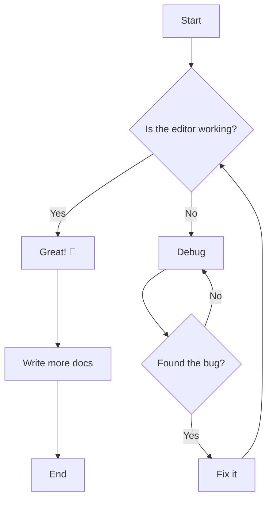
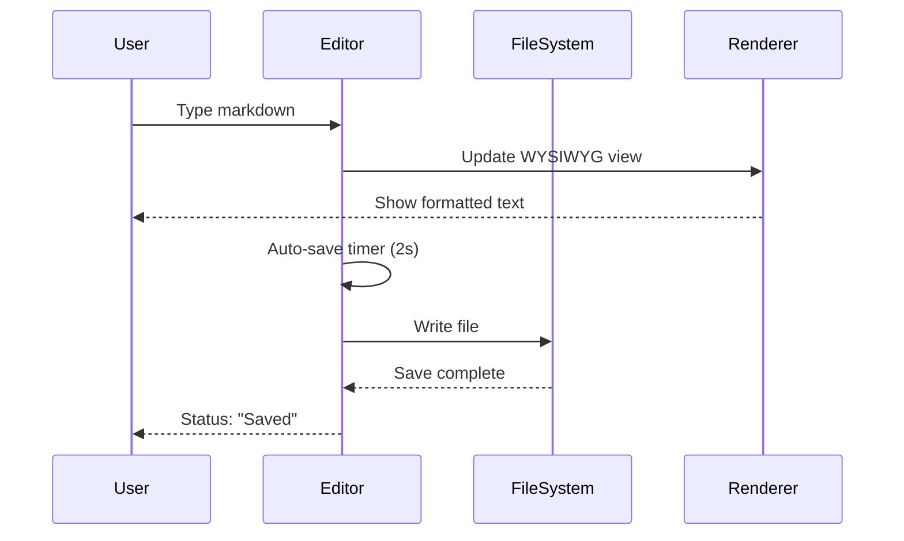
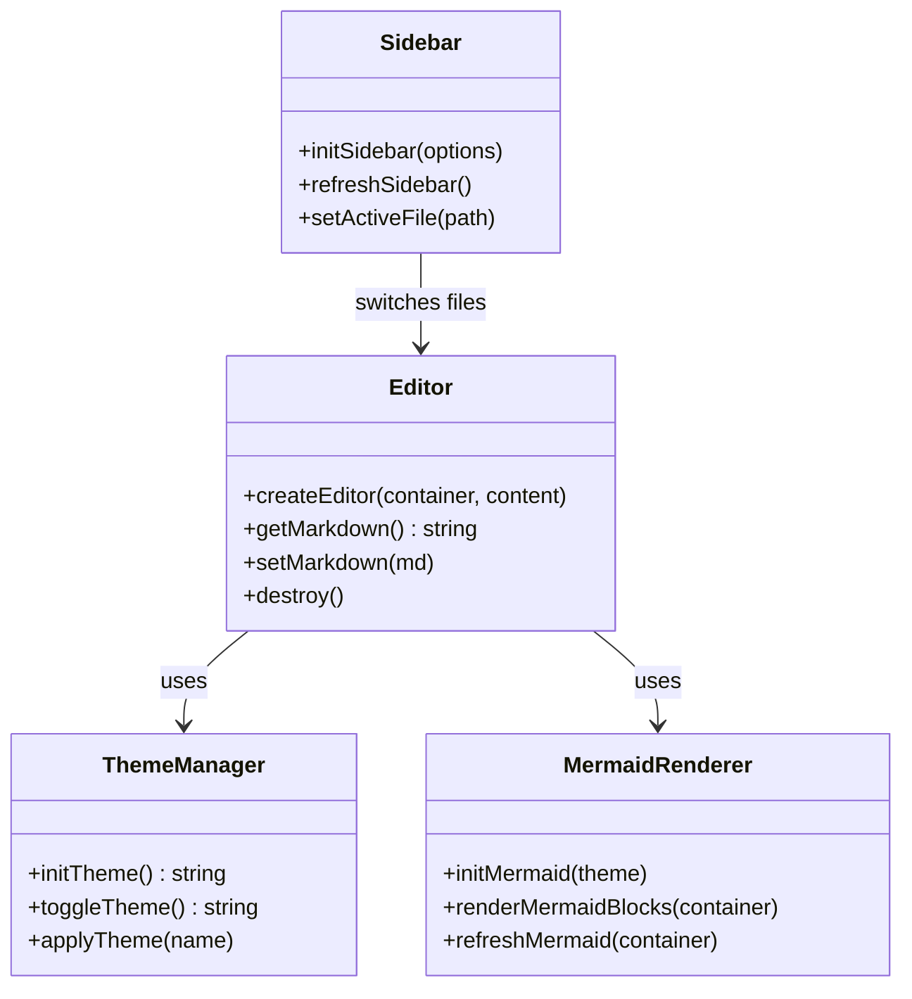
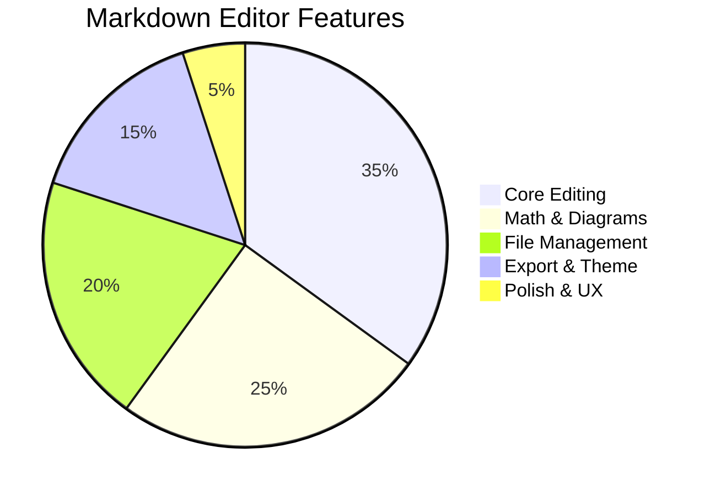
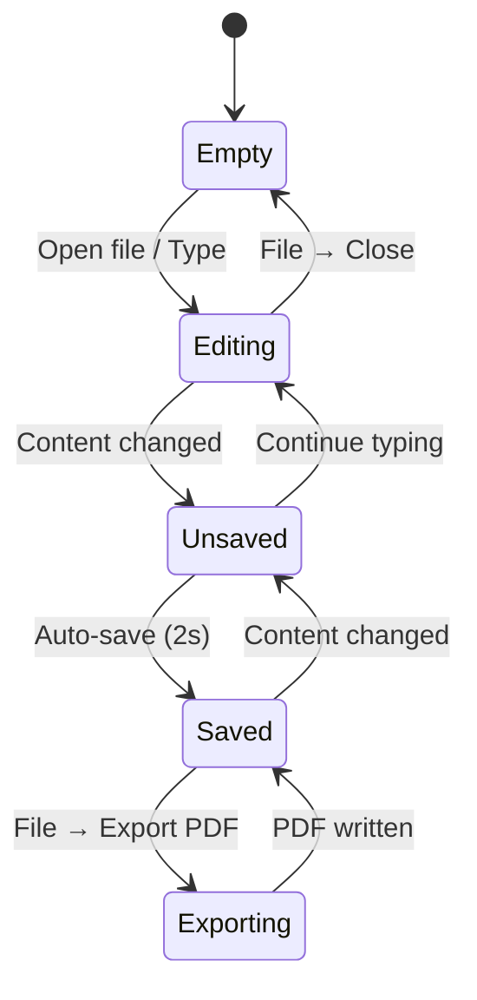

# Markdown Editor — Test Document

This document tests all features of the WYSIWYG Markdown Editor.

---

## 1. Basic Formatting

This is **bold text** and this is *italic text*. Here is ~~strikethrough~~ and `inline code`.

You can also use ***bold and italic*** together.

## 2. Headings

# Heading Level 1
## Heading Level 2
### Heading Level 3
#### Heading Level 4

## 3. Lists

### Unordered
- Item one
- Item two
  - Nested item A
  - Nested item B
- Item three

### Ordered
1. First step
2. Second step
   1. Sub-step A
   2. Sub-step B
3. Third step

### Task List
- [x] Completed task
- [ ] Pending task
- [ ] Another task

## 4. Links and Images

[Markdown Guide](https://www.markdownguide.org)

## 5. Blockquote

> This is a blockquote.
> It can span multiple lines.
>
> — Someone Famous

> **Nested blockquote with formatting:**
> - Item in a quote
> - Another item

## 6. Horizontal Rule

Above

---

Below

## 7. Tables

| Feature | Status | Notes |
|---------|--------|-------|
| Bold/Italic | ✅ | Basic text formatting |
| Headings | ✅ | Levels 1-4 |
| Lists | ✅ | Ordered, unordered, task lists |
| Tables | ✅ | With column alignment |
| Code Blocks | ✅ | Syntax highlighting |
| LaTeX | ✅ | Math rendering |
| Mermaid | ✅ | Diagram rendering |
| Images | ✅ | Local and remote |

### Aligned Columns

| Left | Center | Right |
|:-----|:------:|------:|
| A    | B      | C     |
| 1    | 2      | 3     |

## 8. Code Blocks

### Python
```python
def fibonacci(n: int) -> int:
    """Return the n-th Fibonacci number."""
    if n <= 1:
        return n
    a, b = 0, 1
    for _ in range(n - 1):
        a, b = b, a + b
    return b

# Print first 10 Fibonacci numbers
for i in range(10):
    print(f"F({i}) = {fibonacci(i)}")
```

### MATLAB
```matlab
% Generate and plot a sine wave
fs = 1000;           % Sampling frequency (Hz)
t = 0:1/fs:1;        % Time vector (1 second)
f = 50;              % Signal frequency (Hz)
x = sin(2 * pi * f * t);

figure;
plot(t, x, 'LineWidth', 1.5);
xlabel('Time (s)');
ylabel('Amplitude');
title('50 Hz Sine Wave');
grid on;
```

### C++
```cpp
#include <iostream>
#include <vector>
#include <algorithm>

template<typename T>
void printVector(const std::vector<T>& vec) {
    for (const auto& v : vec) {
        std::cout << v << " ";
    }
    std::cout << std::endl;
}

int main() {
    std::vector<int> nums = {3, 1, 4, 1, 5, 9, 2, 6, 5, 3, 5};
    std::sort(nums.begin(), nums.end());
    printVector(nums);
    return 0;
}
```

### Bash
```bash
#!/bin/bash
# Count and list Markdown files in a directory
DIR="${1:-.}"
echo "Searching for .md files in: $DIR"
count=$(find "$DIR" -maxdepth 1 -name "*.md" -type f | wc -l)
echo "Found $count Markdown file(s):"
find "$DIR" -maxdepth 1 -name "*.md" -type f -exec basename {} \;
```

### JavaScript
```javascript
// Debounce utility (used by the editor's auto-save!)
function debounce(fn, delay) {
  let timer = null;
  return function (...args) {
    clearTimeout(timer);
    timer = setTimeout(() => fn.apply(this, args), delay);
  };
}

// Usage
const autoSave = debounce(() => {
  console.log('Saving...');
}, 2000);
```

## 9. LaTeX Math

### Inline Math

Pythagorean theorem: $a^2 + b^2 = c^2$

Einstein's equation: $E = mc^2$

Quadratic formula: $x = \frac{-b \pm \sqrt{b^2 - 4ac}}{2a}$

Euler's identity: $e^{i\pi} + 1 = 0$

### Block Math

Gaussian integral:
$$
\int_{-\infty}^{\infty} e^{-x^2} \, dx = \sqrt{\pi}
$$

Matrix multiplication:
$$
\begin{pmatrix}
a & b \\
c & d
\end{pmatrix}
\begin{pmatrix}
x \\
y
\end{pmatrix}
=
\begin{pmatrix}
ax + by \\
cx + dy
\end{pmatrix}
$$

Fourier transform:
$$
\hat{f}(\xi) = \int_{-\infty}^{\infty} f(x) \, e^{-2\pi i \xi x} \, dx
$$

Maxwell's equations:
$$
\begin{aligned}
\nabla \cdot \mathbf{E} &= \frac{\rho}{\epsilon_0} \\
\nabla \cdot \mathbf{B} &= 0 \\
\nabla \times \mathbf{E} &= -\frac{\partial \mathbf{B}}{\partial t} \\
\nabla \times \mathbf{B} &= \mu_0 \mathbf{J} + \mu_0 \epsilon_0 \frac{\partial \mathbf{E}}{\partial t}
\end{aligned}
$$

## 10. Mermaid Diagrams

### Flowchart


### Sequence Diagram


### Class Diagram


### Pie Chart


### State Diagram


## 11. Mixed Content

> **Theorem (Pythagoras):** For any right triangle with legs $a$ and $b$ and hypotenuse $c$:
> $$a^2 + b^2 = c^2$$
>
> This is one of the most fundamental results in Euclidean geometry.

### Table with Inline Math

| Function | Formula | Derivative |
|----------|---------|------------|
| Constant | $f(x) = c$ | $f'(x) = 0$ |
| Power | $f(x) = x^n$ | $f'(x) = nx^{n-1}$ |
| Exponential | $f(x) = e^x$ | $f'(x) = e^x$ |
| Natural Log | $f(x) = \ln x$ | $f'(x) = \frac{1}{x}$ |
| Sine | $f(x) = \sin x$ | $f'(x) = \cos x$ |

---

> **End of test document.** All features should render correctly in WYSIWYG mode.
> 
> **Verification checklist:**
> - [ ] Bold, italic, strikethrough render correctly as formatted
> - [ ] Headings appear at correct sizes (H1 > H2 > H3 > H4)
> - [ ] Lists render with proper bullets and numbering
> - [ ] Blockquotes show with left border/indentation
> - [ ] Horizontal rule is a visible separator line
> - [ ] Tables render with borders and proper alignment
> - [ ] Code blocks show syntax highlighting in appropriate colors
> - [ ] Inline LaTeX ($...$) renders as formatted equations
> - [ ] Block LaTeX ($$...$$) renders as centered display equations
> - [ ] Mermaid flowchart renders as SVG diagram
> - [ ] Mermaid sequence diagram renders with arrows
> - [ ] Mermaid class diagram renders with class boxes
> - [ ] Mermaid pie chart renders as pie
> - [ ] Mermaid state diagram renders as state machine
> - [ ] Theme toggle (Ctrl+T) switches light ↔ dark
> - [ ] Auto-save updates status bar (Unsaved… → Saved)
> - [ ] PDF export (File → Export PDF) works
> - [ ] Sidebar shows .md files and allows switching
